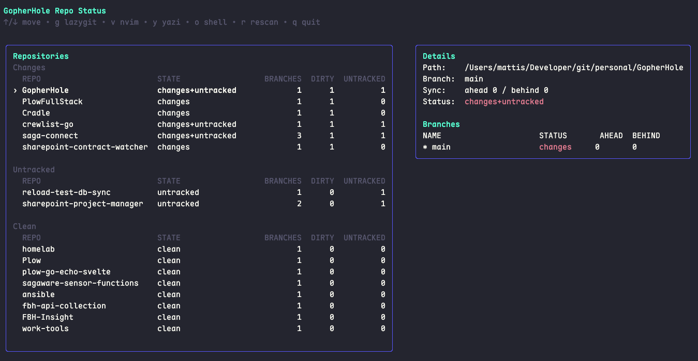

# GopherHole

[](https://go.dev/)
[](./LICENSE)
[](https://github.com/charmbracelet/bubbletea)

A terminal UI for scanning folders, discovering Git repositories, and viewing their status in one place.

## Why GopherHole?

If you juggle many repos, checking each one manually is slow and noisy. GopherHole gives you a single dashboard to:

- find repos across multiple root folders
- instantly spot dirty/untracked/clean states
- jump straight into tools (`lazygit`, `nvim`, `yazi`, shell)

## Demo

> Add your screenshots/GIFs to `docs/assets/` and update these links.



<!--  -->

## Features

- Recursively scans configured folders for Git repos
- Skips heavy dirs like `node_modules`
- Groups repos by status (changes, untracked, clean, errors)
- Branch overview (ahead/behind + current branch working-tree status)
- Fast keyboard navigation
- Tool integrations:
  - `g` → `lazygit`
  - `v` → `nvim` (selected repo)
  - `e` → `nvim` (GopherHole config)
  - `y` → `yazi`
  - `o` → shell in repo dir

## Requirements

- Go 1.22+
- Git
- Optional: `lazygit`, `nvim`, `yazi`, `gitleaks`

## Optional tools (macOS / Linux)

### lazygit

- macOS (Homebrew): `brew install lazygit`
- Linux:
  - Debian/Ubuntu: `sudo apt install lazygit` (if available)
  - Fedora: `sudo dnf install lazygit`
  - Arch: `sudo pacman -S lazygit`

### neovim

- macOS (Homebrew): `brew install neovim`
- Linux:
  - Debian/Ubuntu: `sudo apt install neovim`
  - Fedora: `sudo dnf install neovim`
  - Arch: `sudo pacman -S neovim`

### yazi

- macOS (Homebrew): `brew install yazi ffmpegthumbnailer sevenzip jq poppler fd ripgrep fzf zoxide`
- Linux:
  - Debian/Ubuntu: `sudo apt install yazi ffmpegthumbnailer p7zip-full jq poppler-utils fd-find ripgrep fzf zoxide`
  - Fedora: `sudo dnf install yazi ffmpegthumbnailer p7zip jq poppler-utils fd-find ripgrep fzf zoxide`
  - Arch: `sudo pacman -S yazi ffmpegthumbnailer p7zip jq poppler fd ripgrep fzf zoxide`

### gitleaks

- macOS (Homebrew): `brew install gitleaks`
- Linux:
  - Debian/Ubuntu: `sudo apt install gitleaks` (if available)
  - Fedora: `sudo dnf install gitleaks` (if available)
  - Arch: `sudo pacman -S gitleaks`
  - Fallback (all distros): download release binary from `https://github.com/gitleaks/gitleaks/releases`

## Install

### Recommended

```bash
./install.sh
```

Optional custom install dir:

```bash
INSTALL_DIR=/usr/local/bin ./install.sh
```

### Manual build

```bash
go build -o gopherhole .
```

Then place it somewhere in your `PATH`:

```bash
mkdir -p "$HOME/.local/bin"
cp gopherhole "$HOME/.local/bin/gopherhole"
chmod +x "$HOME/.local/bin/gopherhole"
```

## Configuration

Default config path (macOS + Linux):

```text
~/.config/gopherhole/repos.config.json
```

Initialize it automatically:

```bash
gopherhole init
```

Or create manually:

```bash
mkdir -p "$HOME/.config/gopherhole"
cp repos.config.example.json "$HOME/.config/gopherhole/repos.config.json"
```

Config format:

```json
{
  "folders": ["/path/to/work", "/path/to/personal"]
}
```

Override config location:

```bash
gopherhole -config /path/to/repos.config.json
```

## Usage

```bash
gopherhole
```

### Keybindings

- `↑/↓` or `j/k` — move selection
- `r` — rescan repos
- `g` — open selected repo in `lazygit`
- `v` — open selected repo in `nvim`
- `e` — open GopherHole config in `nvim`
- `y` — open selected repo in `yazi`
- `o` — open shell in selected repo
- `t` — in gitleaks popup: create `LEAKS_TODO.md` in selected repo
- `q` — quit

## Cross-compile

```bash
GOOS=linux GOARCH=amd64 go build -o gopherhole-linux-amd64 .
GOOS=linux GOARCH=arm64 go build -o gopherhole-linux-arm64 .
GOOS=darwin GOARCH=arm64 go build -o gopherhole-darwin-arm64 .
GOOS=darwin GOARCH=amd64 go build -o gopherhole-darwin-amd64 .
```

## Notes

Branch file-status accuracy is complete for the currently checked-out branch.
For non-checked-out branches, commit divergence (ahead/behind) is shown.

Gitleaks reports are persisted to:

- `~/.local/share/gopherhole/reports/`
- index file: `~/.local/share/gopherhole/reports/index.ndjson`
